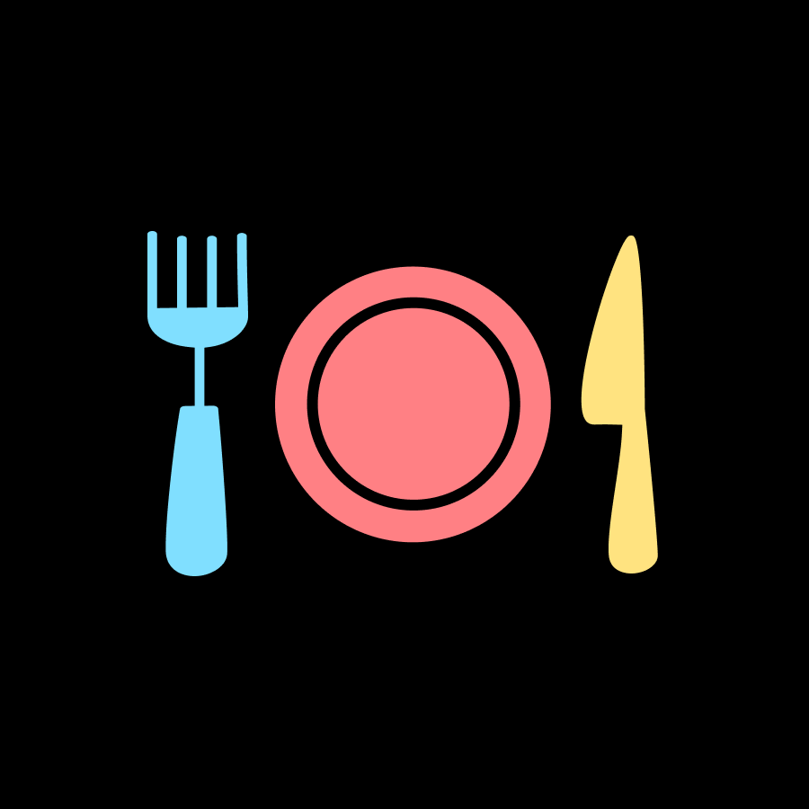

<p align="center">
  
  <h1 align="center">The Mess Menu App</h1>
</p>

This is a website that shows you the BITS Goa cafeteria menu for any day of the week. That's it. Dead simple.

Before this app, in the COVID batch of 2020:
1. You would take a photo of the new mess menu every month
1. Upload it to Google Drive, just so you can put a shortcut to it on your homescreen
1. Click on it, wait for Google Drive to open, remember what day it was, then zoom into that day's menu

Now? You just open this app.

I created this in my 2nd year of college, and the Developer's Society of BITS Goa called it, "useless".
Since then, it has amassed 1,000 daily active users on average. Suck it, DevSoc.

## 📚 Explanation

The core part of the website is pretty simple. You just have to put the mess menu data in JavaScript, calculate what day it is, and display it on screen.<br>
Simple enough. But what made this app successful was its performance, UI and convenience features.

To be specific, this is a [Progressive Web App (PWA)](https://web.dev/articles/what-are-pwas) - a website that can be installed on your homescreen like a regular app.<br>
Once this app loads, it saves (or 'caches') everything it needs to the browser. This means that after using it once, you can use it without connecting to the internet.
And it loads instantaneously!<br>

## 🛠 Development

Assuming you have `git` installed, run this command to download (clone) this repository on your machine:

```
$ git clone https://github.com/aryanpingle/Mess-Menu
```

This will create a folder called "Mess-Menu" containing all of its code. Everything is written in pure HTML, CSS and JavaScript.<br>
You can open the website by running a local server in this directory - I recommend the [`Live Server` extension for VSCode](url).

| File | Explanation |
|------|-------------|
| `index.html` | The HTML code for the homepage. The `<meta>` tags are super important for Search Engine Optimization, and for showing website previews on Twitter / WhatsApp. |
| `menu.json` | Contains the mess menu for the month. Every dish is separated by a comma and a space `,_` which is used to split them in `main.js`. |
| `main.js` | The JavaScript code needed for loading the menu of the day, for letting the user decide which day's menu to look at, etc. |
| `main.css` | Contains the CSS styles for the website. |
| `manifest.json` | (Needed only for PWA) Contains information needed to display the app on the user's homescreen if they install it. |
| `sw.js` | (Needed only for PWA) Contains the logic to handle requests made by the website to the internet. Mainly responsible for allowing the app to work offline. |

**NOTE**: If you want to contibute by changing `menu.json`, keep the following in mind:

1. **Put Main Dishes First** - Put stuff like _Chicken Biryani_ and _Paneer Biryani_ before items like _Veg Raita_. This helps the user read the menu quicker.
2. **Use Consistent Spelling** - I don't care what spelling you use for items like _Rassam_, but keep its spelling the same everytime you type it.
3. **Use A Slash To Show Options** - Put a space on either side of the slash when there are two options for the day eg: `Paneer Biryani / Bhurji`.
4. **Testing** - Once you add something to the menu, open the site and go through it once. This app runs on trust - if the users think that they can't trust your menu, they will stop using it.

## ❗❗❗ One Last Thing...

If you have any questions, feel free to contact me or raise an issue to clarify it. I learnt a lot while making this app, and this is honestly my favourite project to have worked on. Never stop learning!
